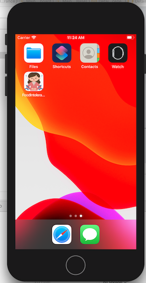

# Dietary-Limitations-Swift-App

## Description
This is an iOS app to track how foods impact my digestive health.
See this short video for more details: https://pro.panopto.com/Panopto/Pages/Viewer.aspx?tid=8311012b-5a2f-4896-9476-abb601298c6a

## Stack
This app was created in Swift utilizing XCode.

## Lessons Learned
This is the first iOS app I created. I learned the basics of the Swift programming language, how to debug Swift errors in XCode, and how to grab data from an external API and present it in a TableView and on a detail page, among other lessons. 

Currently data can only be read from the API. The next step would be to add functionality such that the user can add meal data and post to the API. I also intend to add a sign in page and graphics to show how meals impact digestive health. I aim to add a bar chart that shows a given ingredient to a meal and the number of times a meal the ingredient is in has caused digestive distress. This would allow me to understand what ingredients may be the source of the issue. 
